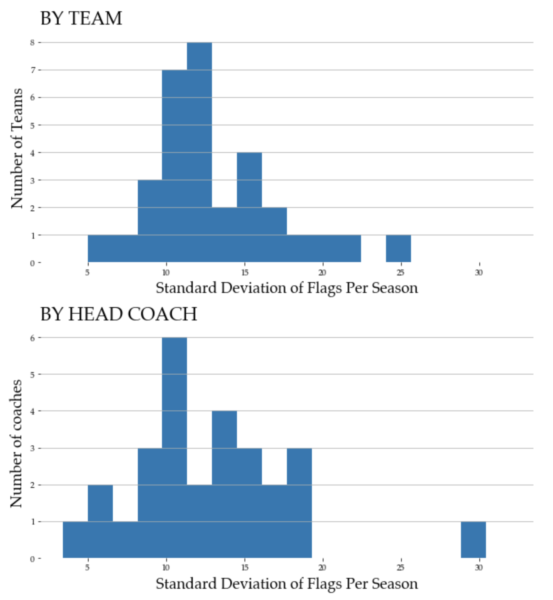
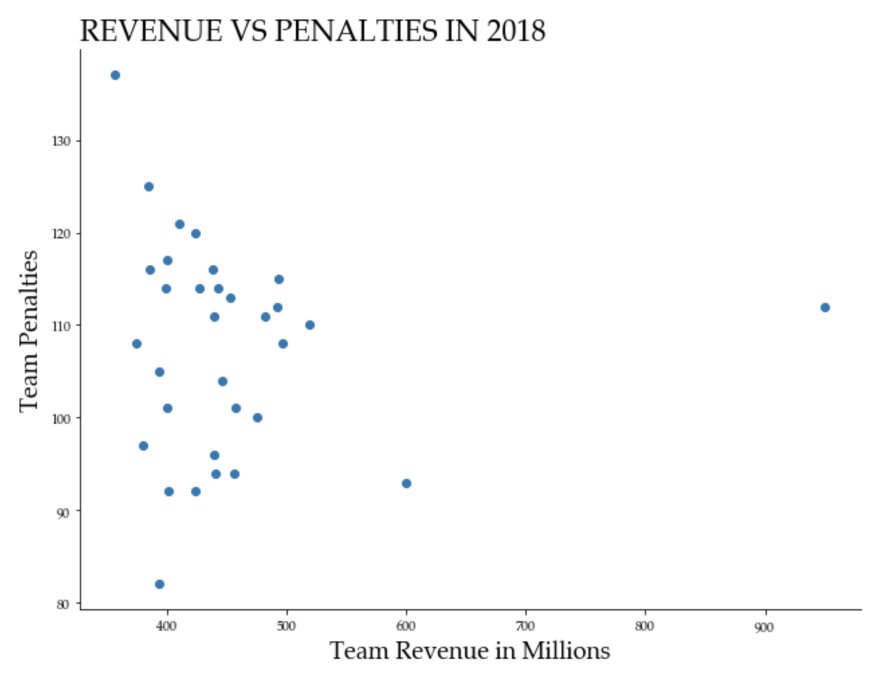

# flag-on-the-play

## Desciption

This repo is home to a project I embarked on for two purposes; firstly to utilize a dataset I had put together from several publicly available sources for analyzing questions relating to NFL penalties and whether or not a given team (in my case the Seattle Seahawks for purely personal reasons) is being unfairly targeted by the officiating team for penalties. The second purpose for this project is essentially to gain extra practice with my AWS skillset by the instantiation of a SQL Server database with AWS' RDS which I then utilized to conduct the bulk of the analysis used for addressing the fundamental question behind this project. I was then able to provide this database along with the questions that I was interested in answering with it as a platform to host a bi-monthly sql practice night organized by fellow data scientist Isaac Campbell-Smith. For those interested, his primary repository for the SQL practice nights can be found [here](https://github.com/isaac-campbell-smith/Pokestars). The practice workbook for that event can be found within this repo although for security reasons the login credentials for the database instance have been removed. If anyone is interested in utilizing this workbook for practicing their sql skills, please feel free to contact me, and access can be arranged. 

## The Problem 

As an NFL fan, (and a fan of the Seattle Seahawks in particular) I occasionally find myself watching football with my dad, and whenever I do, the accusation inevitably creeps in that the referees are biased in the way that they make penalty calls – specifically that for a given illegal action, a penalty will be called against the Seahawks for a higher percentage of the instances of the illegal action than the opposing team. Personally, I’m not good enough at spotting every penalty on the screen to say with confidence whether or not this is the case, and to be honest, my suspicion is that this feeling of one’s own team being unfairly persecuted is one harbored by most sports fans regardless of the team they root for. It occurs to me though, that as a data scientist, this sports fan is uniquely qualified to actually grab some data and attempt to vet this theory as it applies to my own team with a more objectice approach.  

## Data Pipeline

I was able to find detailed penalty data both by team and individual player spanning the current NFL season to as far back as the 2009 season from [nflpenalties.com]( https://www.nflpenalties.com/), which I was able to retrieve from the site and structure into two separate tables for analysis. While data on the playoffs of previous seasons was available, I only grabbed data from regular season games for consistency; if the post-season penalties where included, teams that consistently made it into the post season would have a higher number of penalties just by way of having played more games. I also supplemented this data by scouring the internet for head coaching records and manually inputting this data into the teams data table. 

Once gathered I utilize this data to populate several tables in a SQL Server database that I created using Amazon Web Service’s Relational Database Service for hosting. 

I then connected to the database using a Python based Jupyter Notebook and through Python make SQL queries that formed the bulk of analysis behind this problem. For anyone who would like to learn more about this process either out of curiosity or the necessity of following a similar process, a detailed account of this process can be found at another repository that I created specifically as a guide to this process [here](https://github.com/dougtheeconomist/sql-server-with-AWS-setup-guide). Once I successfully queried the specific information that I need, the utility of doing all of this in a notebook allows me to then save this to a Pandas Dataframe and conduct the statistical testing required to definitively provide some statistically robust evidence to shed light on the question at hand. 

## Methodology

The accusation at the heart of this study really has to do with penalties that are not called, for which there is no record, which makes this claim very hard to definitively confirm or refute. However, data on called penalties *is* published and publicly available, and through thoughtful analysis of the penalties that *were* called, we can at least see if there is strong evidence of a bias towards calling penalties against certain teams more often than others. 

The first thing to do is to compare the number of penalties that each team accrues across the league. The Seahawks do rank high on the list of most penalized teams in the league at number five, however, this is not evidence to say that these high penalty numbers are unwarranted. The tricky thing to find here is evidence that the Seahawks high penalties numbers are due to some sort of bias rather than the alternate explanation that the team simply has a play or coaching style that is inherently less careful about adhering to the rules. So how does one find evidence that these penalties are not fairly called on account of a more careless play style of the team? 

The answer is to look not at the team as a whole, but to look at the players individually; specifically players who have played on other teams within the league and have a record of penalties when playing for other teams as well as for Seattle. If examination of these numbers points to a trend of the same players receiving less penalties when playing on another team than when playing on Seattle, this could be strong evidence that there is something to this theory. As with any statistical hypothesis testing, the presence of such a trend would not be proof of such a bias, but it would be evidence that there is reason to look into the issue further. The following two histograms show the breakdown of average penalties called against this subset of players when they are playing for Seattle and when they are on other teams. 

Of note is the statistical outlier on the bottom graph; this is Brandon Browner, whose accrued an average of 18 penalties per season when playing for other teams (and 9 per season when playing for Seattle). When I include Browner in the analysis these numbers show that players who have a record with other teams as well as the Seahawks get called for more fowls per season when playing for other teams, but just barely. Average penalties for Seattle for these players is 5.4, vs 5.7 for other teams. If we exclude Browner from both categories, the remaining players do get more penalized when playing for Seattle, but just by a hair; there is practically no difference. A hypothesis test tells us that even the bigger difference when Browner is included between the average penalties when on and off of Seattle’s roster is not statistically significant, meaning that the difference between the two is likely due to random chance (which comes as no surprise given the small margin), but even at no difference between the two, there is no evidence here to suggest a systematic bias against Seattle. 

The other exploration that can be done of the data available to shed light on the question is to attempt to get a sense for how much coaching effects the number of penalties accrued. I would expect that coaching would have some effect on penalty accrual as well. Since coaches, like players can move from team to team, we could expect to see changes in penalty trends when coaching staff changes. That is if a highly penalized team’s coach moves to another team, the penalties would follow the coach and not stay with a team. If however the penalties tend to stay with the team and *not* follow the coach, this could be a sign that there may be some bias for or against certain teams in how penalties calls are made. Again this would not be a smoking gun, but rather a warning sign that further research is needed. 

It would be ideal to look at penalties under Seahawks coaches when they moved teams, however, as all but one year of available data has Pete Carroll as the head coach, and does not include Carroll coaching any other team in the league (he was coaching at the collegiate level prior to taking the job with Seattle), this is not possible. I have to settle for inferring conclusions from a more general look at coaching influence. 

To address this issue, I look at a measure of the discrepancy in the number of penalties per season for organizational teams vs the same metric for all teams under a given head coach. For example the variation across all seasons for the Philadelphia Eagles vs variation across whichever team is coached by Andy Reid, which would include the Eagles for some seasons and the Kansas City Chiefs for others. If there is bias against teams present, we could expect to see lower discrepancies from season to season for teams by location than for teams under given coaches. 

What I found is that the deviation in seasonal penalties is lower across teams under the same head coach than teams by location. This difference is not large enough to be statistically significant however, the likelihood that the difference seen is just due to random variation rather than coaching having a significant impact on penalties is 77.8%. A comparison can be seen below.

The last analysis that I conducted to leave no stone unturned, is to check to see if there are connections between penalty calls and league finances. The critical look that I took at available data to make sure that there isn't anything measurable to find here is to compare the number of penalties committed by each team to the amount of revenue that each team brings in for the NFL each year. If there were any sort of persistent bias present on account of the officiating team, the biggest motivation that I can think of for such a bias would be to boost ratings via making sure that the most popular teams get the best chance of making the playoffs and therefore the most play time. Given that the NFL brings in billions of dollars every year, this could be a big incentive to league ownership to maximize income. Since the teams around the league engage in a degree of profit sharing, such a practice may not even be detrimental to the less popular team's finances, and therefore one could reasonably see a scenario in which less popular franchises wouldn't have the incentive to look into this as one might think on the face of things. While yearly data is not publicly available for free of revenues by franchise, I was able to track down the numbers for the 2018 season thanks to an article published by [Forbes](https://www.forbes.com/sites/mikeozanian/2020/05/18/the-stadium-revenue-each-nfl-team-will-lose-if-games-are-played-without-fans/?sh=40a2f0da691a). When I measure these figures agains the penalty counts for that year, I see practically no correlation between the two, which can be seen visually in the following scatter plot.  

## Conclusions

Okay, so after looking at these comparisons what can one actually say here? We’ve shown that players who have played on both Seattle and another team do not get targeted more frequently for penalty calls when wearing a Seattle jersey; the opposite in fact, this subgroup of players who have both experiences tend to have more penalty calls against them while wearing other team colors (although not in significantly big numbers to concretely say that there is a definitive trend). Furthermore when searching for evidence that coaching matters less than the team playing, a finding which could suggest bias against the team regardless of how they are being coached, once again we see weak evidence in the opposite direction, albeit statistically speaking, it’s kind of a wash. 

Though it may be convenient or satisfying to point and yell at the refs when things go the wrong way for my team, the evidence to back it up according to available data just isn’t there.

## Apendix: Database Schema

guest.teams table

|id 			   | Description                                | Type      |
|------------------|:-------------------------------------------|:----------|
| year      	   | Year of football season                    | INT       |
| team_city 	   | City where team is located                 | VARCHAR   |
| team_id   	   | id number unique to team                   | INT       |
| coach_name       | Name of team coach                         | VARCHAR   |
| coach_id         | id number unique to coach                  | INT       |
| ranking          | Rank of most to least penalized            | INT       |
| games     	   | Games played that season                   | INT       |
| plays            | Number of plays that season                | INT       |
| against_count    | Number of flags against team               | INT       |
| agnst_yrds       | Total yards penalized in season            | INT       |
| ben_count        | Number of flags on opposing team           | INT       |
| ben_yrds     	   | Yards given for opposing flags             | INT       |
| net_count        | Team flags less opposing flags	            | INT       |
| net_yrds         | Yards lost plus yards gained from penalties| INT       |
| total_flags      | Total flags thrown in team's games         | INT       |

guest.players table

|id 	        | Description                                | Type      |
|---------------|:-------------------------------------------|:----------|
| year      	| Year of football season                    | INT       |
| player_name 	| Name of player                             | VARCHAR   |
| player_id   	| id number unique to player                 | INT       |
| position      | Abreviation for player's position          | VARCHAR   |
| team          | City where team is located                 | VARCHAR   |
| team_id       | id number unique to team                   | INT       |
| pen_count     | Number of inforced penalties against player| INT       |
| yards         | Yards lost due to flags on player          | INT       |
| n_flags       | All player penalties, includes declined    | INT       |
| pre_snap      | Flags by player prior to start of play     | INT       |
| per_game      | Number of times penalized per game         | INT       |
| yards_game    | Yards lost from penalites per game         | INT       |
| of_team       | Percentage of teams penalties from player  | INT       |
